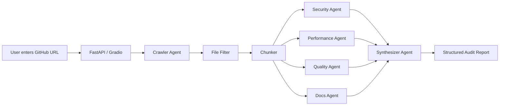

# SwarmAudit

Paste any public GitHub URL. Get a structured multi-agent code audit in minutes.

SwarmAudit is an AI-agent code review system for the AMD Developer Hackathon. It clones a public repository, filters and chunks source files, runs specialized review agents, and returns a severity-ranked report with file references and suggested fixes.

The local MVP runs in mock-first mode, so the demo works without waiting for ROCm, vLLM, or MI300X infrastructure. The inference layer is designed to switch to a vLLM-compatible Qwen2.5-Coder endpoint later.

## MVP

SwarmAudit currently runs with a mock-first LLM interface so the demo is not blocked by ROCm, vLLM, or AMD MI300X setup. The current graph is:

```text
GitHub URL -> Crawler -> Chunker -> [Security Agent + Performance Agent + Quality Agent + Docs Agent] -> Synthesizer -> Report
```

## Demo Status

Working locally:

- Gradio UI with live agent progress
- Gradio Diagnostics tab for mock/vLLM connection checks
- Gradio Benchmark tab scaffold for mock/vLLM latency probes
- FastAPI `/health` and `/audit` endpoints
- FastAPI `/llm/health` endpoint
- GitHub clone and repo scan on public repos
- Four analysis agents plus synthesizer
- Prioritized report display with full raw finding totals preserved
- Markdown and JSON report downloads
- Hugging Face Spaces-style `app.py` entrypoint

Smoke-tested repos:

- `https://github.com/psf/requests`
- `https://github.com/pallets/itsdangerous`

Example output is available in [`examples/requests_report_excerpt.md`](examples/requests_report_excerpt.md).

## Architecture



The graph is intentionally modular: each agent returns strict Pydantic findings, and the synthesizer merges, deduplicates, prioritizes, and formats the final report.

## Quick Start

```bash
python -m venv .venv
.venv\Scripts\activate
pip install -r requirements.txt
```

Run the FastAPI backend:

```bash
uvicorn app.main:app --reload
```

If port 8000 is busy on Windows, use:

```bash
uvicorn app.main:app --reload --port 8001
```

Health check:

```bash
curl http://127.0.0.1:8000/health
```

LLM health check:

```bash
curl http://127.0.0.1:8000/llm/health
```

Audit endpoint:

```bash
curl -X POST http://127.0.0.1:8000/audit \
  -H "Content-Type: application/json" \
  -d '{"repo_url":"https://github.com/psf/requests"}'
```

Run the Gradio demo:

```bash
python -m app.ui.gradio_app
```

For Hugging Face Spaces-style startup:

```bash
python app.py
```

The Gradio app includes example repos, a live agent progress panel, a structured markdown report panel, and Markdown/JSON report downloads.
The launcher binds to `0.0.0.0` and uses `PORT` when provided, which matches hosted Gradio deployment expectations.

## Configuration

Copy `.env.example` to `.env` for local overrides. Default inference mode is:

```text
LLM_PROVIDER=mock
```

Later, set `LLM_PROVIDER=vllm` and point `LLM_BASE_URL` at an OpenAI-compatible vLLM endpoint running Qwen2.5-Coder.
Use the Gradio Diagnostics tab or `/llm/health` endpoint to confirm vLLM connectivity before running audits.

LLM enrichment is off by default:

```text
ENABLE_LLM_ENRICHMENT=false
```

Turn it on only after the Diagnostics tab confirms the vLLM endpoint is healthy.
When enabled, SwarmAudit keeps static rules as deterministic guardrails and uses the LLM only to enrich selected chunks with additional validated findings. Security, Performance, Quality, and Docs agents all use the same safe enrichment path and fall back to static findings if the LLM fails.

For the first AMD credit-backed test, keep enrichment off until diagnostics pass, then use conservative limits:

```text
LLM_PROVIDER=vllm
ENABLE_LLM_ENRICHMENT=true
MAX_FILES=100
MAX_FILE_SIZE_KB=150
MAX_CHARS_PER_CHUNK=8000
MAX_LLM_CHUNKS=2
```

Key safety limits:

```text
MAX_FILES=200
MAX_FILE_SIZE_KB=250
MAX_CHARS_PER_CHUNK=12000
CLONE_BASE_DIR=.swarm_audit_tmp
```

## Report Schema

Each finding includes:

- title
- severity: CRITICAL, HIGH, MEDIUM, LOW
- file path and line range
- description
- why it matters
- suggested fix
- agent source

Reports preserve full finding totals while displaying a prioritized subset for readability. High-severity findings are shown first, repeated low-severity findings are summarized, and warnings explain when lower-priority findings are hidden from the demo report.

## Current Agents

- Security Agent: flags hardcoded secrets, disabled TLS verification, and dynamic code execution.
- Performance Agent: flags HTTP calls without timeouts, blocking sleep inside async functions, nested loops, file reads in loops, and synchronous Node.js filesystem calls.
- Quality Agent: flags long functions, high branch density, large source sections, unresolved TODO/FIXME/HACK comments, and very short symbol names.
- Docs Agent: flags incomplete README guidance and public Python symbols missing docstrings.
- Synthesizer Agent: deduplicates findings, sorts by severity, and builds the final report.

## Hugging Face Spaces

SwarmAudit is ready to launch as a Gradio Space with the root `app.py` entrypoint. Keep `LLM_PROVIDER=mock` for a reliable public demo, then switch to `LLM_PROVIDER=vllm` when an AMD MI300X-hosted Qwen2.5-Coder endpoint is available.

See [`HF_SPACES_DEPLOY.md`](HF_SPACES_DEPLOY.md) for the deployment checklist.
See [`AMD_VLLM_RUNBOOK.md`](AMD_VLLM_RUNBOOK.md) for the credit-safe AMD/vLLM setup flow.

Recommended Space settings:

- SDK: Gradio
- App file: `app.py`
- Python: 3.11 or newer
- Default env: `LLM_PROVIDER=mock`

## AMD MI300X Roadmap

The current code path is intentionally mock-first, so the public demo remains reliable even without GPU access. The AMD/vLLM path is HTTP-only: no vLLM package is required in this app, and no code changes should be needed after the endpoint is available.

1. Start a Qwen2.5-Coder vLLM server on AMD Developer Cloud.
2. Expose OpenAI-compatible `/v1/models` and `/v1/chat/completions` endpoints.
3. Set `LLM_PROVIDER=vllm`, `LLM_BASE_URL`, `LLM_API_KEY`, and `LLM_MODEL`.
4. Run Diagnostics before enabling LLM enrichment.
5. Enable enrichment with `MAX_LLM_CHUNKS=2` for the first credit-safe audits.
6. Run the Benchmark tab and record MI300X latency/throughput numbers.

The Benchmark tab is already scaffolded. In mock mode it validates the UI path; in vLLM mode it measures endpoint latency and provides a place to record MI300X numbers for the final demo.

## Tests

```bash
python -m pytest
```


